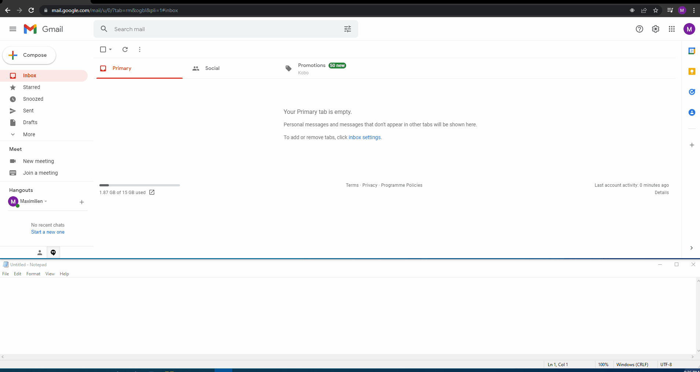

# Encrypted Keylogger

## IMPORTANT NOTICE

This source code is meant for educational purposes only and should not be used for malicious activity. This keylogger can only run on Windows 10 machines. In order to read the captured keystrokes, you will need to provide the credentials of a Gmail account on line 43 and 44 of program.cs. The email address of your Gmail account has to end with @gmail.com. It is also important to know that this program will create a file named printer.dll in your Documents folder (File Explorer) during its execution.

## Description

The way this keylogger works is pretty simple. First, it captures every keystroke typed by the user on the keyboard. Then, every 20 characters typed, it encrypts the keystrokes data with AES encryption before storing the cipher text in a file named 'printer.dll'. The encrypted data and the 'printer.dll' file name are means to hide the intent behind this particular file. Once the cipher text is stored in 'printer.dll', the program then reads inside the file and decrypts the cipher text. It is only when the keystrokes data is decrypted that the program sends it to your gmail account.